# Nazar Second Brain - Infrastructure Diagrams

Complete visual documentation of the system architecture, data flows, and synchronization mechanisms.

---

## 1. High-Level System Architecture

```mermaid
flowchart TB
    subgraph Internet["🌐 Internet (No Direct Access)"]
        direction TB
        ATTACKERS["🦹 Attackers/Scanners"]
        NOTE1["SSH Port 22: Closed to public<br/>HTTPS Port 443: No public IP"]
    end

    subgraph TailscaleNET["🔒 Tailscale VPN Mesh Network (100.x.x.x)"]
        direction TB
        
        subgraph VPS["🖥️ VPS (Debian 13)"]
            direction TB
            
            subgraph Docker["🐳 Docker Container"]
                OPENCLAW["OpenClaw Gateway<br/>(Node.js 22 + Voice Tools)"]
                WHISPER["🎙️ Whisper STT"]
                PIPER["🔊 Piper TTS"]
            end
            
            VAULT_WC[("📁 Vault Working Copy<br/>/srv/nazar/vault")]
            VAULT_GIT[("📦 Vault Bare Repo<br/>/srv/nazar/vault.git")]
            DATA[("💾 Data & Config<br/>/srv/nazar/data")]
            
            CRON["⏰ Cron Job<br/>Auto-commit every 5min"]
            HOOK["🪝 Post-Receive Hook<br/>Auto-deploy on push"]
            
            UFW["🛡️ UFW Firewall<br/>(Tailscale only)"]
            FAIL2BAN["🚫 Fail2Ban"]
            TSD["Tailscale Daemon"]
        end
        
        subgraph LocalDevices["💻 User Devices"]
            LAPTOP["Laptop (Windows)<br/>Obsidian + Git"]
            PHONE["Phone (Android)<br/>Obsidian + Git"]
        end
    end

    %% Connections
    LAPTOP <-->|"Git SSH<br/>debian@100.87.216.31:/srv/nazar/vault.git"| VAULT_GIT
    PHONE <-->|"Git SSH<br/>(same endpoint)"| VAULT_GIT
    
    VAULT_GIT -.->|"Push triggers"| HOOK
    HOOK -->|"Updates"| VAULT_WC
    
    VAULT_WC <-->|"Reads/Writes"| OPENCLAW
    CRON -->|"Commits changes"| VAULT_WC
    CRON -->|"Pushes to"| VAULT_GIT
    
    OPENCLAW <-->|"Voice processing"| WHISPER
    OPENCLAW <-->|"Text-to-speech"| PIPER
    
    TSD <-->|"Serves"| OPENCLAW
    
    UFW -.->|"Blocks"| Internet
    FAIL2BAN -.->|"Bans brute-force"| Internet
    
    LAPTOP -.->|"HTTPS via Tailscale"| OPENCLAW
    PHONE -.->|"HTTPS via Tailscale"| OPENCLAW

    style Internet fill:#ffcccc
    style TailscaleNET fill:#ccffcc
    style VPS fill:#e6f3ff
    style Docker fill:#fff4e6
```



---

## 2. Git Synchronization Flow (Detailed)

```mermaid
sequenceDiagram
    autonumber
    participant LAPTOP as 💻 Local Obsidian
    participant PHONE as 📱 Phone Obsidian
    participant BARE as 📦 Bare Repo<br/>(vault.git)
    participant HOOK as 🪝 Post-Receive<br/>Hook
    participant VPS_WC as 🖥️ VPS Working<br/>Copy
    participant CRON as ⏰ Cron Job
    participant AGENT as 🤖 Nazar Agent
    participant GATEWAY as 🌐 OpenClaw<br/>Gateway

    Note over LAPTOP,GATEWAY: User Creates Note on Laptop
    LAPTOP->>LAPTOP: Auto-commit after 5min
    LAPTOP->>BARE: git push origin main
    activate BARE
    BARE->>HOOK: Trigger post-receive
    HOOK->>VPS_WC: git checkout -f main
    VPS_WC-->>GATEWAY: Notify of changes
    deactivate BARE
    
    Note over PHONE,GATEWAY: Phone Pulls Changes
    PHONE->>BARE: git pull origin main
    BARE-->>PHONE: New note + .obsidian updates
    PHONE->>PHONE: Obsidian refresh
    
    Note over AGENT,GATEWAY: Agent Creates Daily Note
    GATEWAY->>AGENT: Process voice note
    AGENT->>VPS_WC: Write to daily note
    VPS_WC->>VPS_WC: File changed
    
    Note over CRON: Every 5 Minutes
    CRON->>VPS_WC: Check for changes
    alt Changes detected
        CRON->>VPS_WC: git add -A
        CRON->>VPS_WC: git commit -m "Auto-commit"
        CRON->>BARE: git push origin main
        BARE-->>LAPTOP: Available on next pull
        BARE-->>PHONE: Available on next pull
    else No changes
        CRON->>CRON: Sleep until next cycle
    end
```



---

## 3. Data Flow Architecture


---

## 4. Git Repository Structure & Sync Mechanism

```mermaid
graph TB
    subgraph LEGEND["📋 Legend"]
        direction LR
        L1["🟦 Working Copy<br/>(Editable files)"]
        L2["🟨 Bare Repo<br/>(Git database only)"]
        L3["🟩 Hook/Script<br/>(Automation)"]
        L4["➡️ Git Push"]
        L5["⬅️ Git Pull"]
    end

    subgraph GIT_ARCH["🔗 Git Architecture"]
        direction TB
        
        subgraph LOCAL1["💻 Local Laptop"]
            WC1["🟦 Working Copy<br/>C:/Repositories/second-brain"]
            GIT1["🔵 .git folder"]
        end
        
        subgraph LOCAL2["📱 Phone"]
            WC2["🟦 Working Copy<br/>~/storage/second-brain"]
            GIT2["🔵 .git folder"]
        end
        
        subgraph VPS_GIT["🖥️ VPS Git Server"]
            BARE["🟨 Bare Repository<br/>/srv/nazar/vault.git"]
            
            subgraph HOOKS["🪝 Hooks"]
                POST_RECEIVE["post-receive<br/>Updates working copy"]
            end
        end
        
        subgraph VPS_WC["🖥️ VPS Working Copy"]
            WC_VPS["🟦 /srv/nazar/vault"]
            CRON["🟩 Cron Job<br/>Auto-commit script"]
        end
    end

    %% Push flows
    WC1 ==>|"git push origin main"| BARE
    WC2 ==>|"git push origin main"| BARE
    
    %% Hook triggers
    BARE -.->|"triggers"| POST_RECEIVE
    POST_RECEIVE -->|"checkout -f main"| WC_VPS
    
    %% Cron job
    CRON -->|"Every 5 min:<br/>git add -A<br/>git commit<br/>git push"| WC_VPS
    WC_VPS -->|"push"| BARE
    
    %% Pull flows
    BARE ==>|"git pull origin main"| WC1
    BARE ==>|"git pull origin main"| WC2

    style BARE fill:#fff4e6
    style POST_RECEIVE fill:#e6ffe6
    style CRON fill:#e6ffe6
```



---

## 5. Security Architecture (Defense in Depth)

```mermaid
flowchart TB
    subgraph ATTACKER["🦹 Attacker"]
        PORT_SCAN["Port Scan<br/>(22, 443, etc.)"]
        BRUTE_FORCE["SSH Brute Force"]
        MITM["Man-in-the-Middle"]
    end

    subgraph LAYER1["Layer 1: Network"]
        TAILSCALE["🔒 Tailscale VPN<br/>WireGuard Encryption"]
        UFW["🛡️ UFW Firewall<br/>Deny all incoming"]
        NOTE1["SSH: Only Tailscale<br/>HTTPS: Only Tailscale"]
    end

    subgraph LAYER2["Layer 2: Authentication"]
        SSH_KEYS["🔑 SSH Key-Only<br/>(No passwords)"]
        GATEWAY_TOKEN["🎫 Gateway Token Auth"]
        DEVICE_PAIRING["📱 Device Pairing<br/>Approval required"]
    end

    subgraph LAYER3["Layer 3: Container"]
        DOCKER["🐳 Docker Isolation"]
        READ_ONLY["📖 Read-only mounts<br/>(except /vault)"]
        NO_PRIVILEGES["🚫 No privileged mode"]
    end

    subgraph LAYER4["Layer 4: Agent Sandbox"]
        SANDBOX["📦 Sandbox Mode<br/>'non-main' sessions"]
        NETWORK_NONE["🌐 Network: none<br/>(sandboxed)"]
    end

    subgraph LAYER5["Layer 5: Secrets"]
        DOTENV["🔐 .env file<br/>(API keys, tokens)"]
        NEVER_IN_VAULT["🚫 Never commit secrets<br/>to vault"]
    end

    subgraph LAYER6["Layer 6: Auto-Patching"]
        UNATTENDED["🔄 Unattended Upgrades<br/>(Security patches)"]
        FAIL2BAN["🚫 Fail2Ban<br/>(Bans attackers)"]
    end

    subgraph ASSETS["🛡️ Protected Assets"]
        VPS["VPS /srv/nazar/"]
        VAULT["📚 Vault Data"]
        GATEWAY["🌐 Gateway"]
    end

    %% Attack flows (blocked)
    PORT_SCAN -->|"Blocked"| UFW
    BRUTE_FORCE -->|"Blocked"| UFW
    BRUTE_FORCE -->|"Bans IP"| FAIL2BAN
    MITM -->|"Encrypted"| TAILSCALE

    %% Defense layers
    UFW --> TAILSCALE
    TAILSCALE --> SSH_KEYS
    SSH_KEYS --> GATEWAY_TOKEN
    GATEWAY_TOKEN --> DEVICE_PAIRING
    DEVICE_PAIRING --> DOCKER
    DOCKER --> SANDBOX
    SANDBOX --> DOTENV
    DOTENV --> UNATTENDED
    
    %% Protection
    UNATTENDED --> VPS
    FAIL2BAN --> VPS
    DOCKER --> GATEWAY
    SANDBOX --> GATEWAY
    DOTENV --> VAULT

    style ATTACKER fill:#ffcccc
    style ASSETS fill:#ccffcc
    style LAYER1 fill:#e6f3ff
    style LAYER2 fill:#e6f3ff
    style LAYER3 fill:#e6f3ff
    style LAYER4 fill:#e6f3ff
    style LAYER5 fill:#e6f3ff
    style LAYER6 fill:#e6f3ff
```



---

## 6. Request Flow Example (Voice Note Processing)

```mermaid
sequenceDiagram
    autonumber
    actor USER as 👤 User
    participant PHONE as 📱 Phone (WhatsApp)
    participant GATEWAY as 🌐 OpenClaw Gateway
    participant WHISPER as 🎙️ Whisper (STT)
    participant AI as 🤖 LLM
    participant VAULT as 📁 Vault
    participant CRON as ⏰ Cron
    participant BARE as 📦 Bare Repo
    participant LAPTOP as 💻 Laptop (Obsidian)

    USER->>PHONE: Send voice message
    PHONE->>GATEWAY: Webhook with audio
    
    GATEWAY->>WHISPER: Transcribe audio
    WHISPER-->>GATEWAY: "Meeting at 3pm tomorrow"
    
    GATEWAY->>AI: Analyze + extract insights
    AI-->>GATEWAY: Summary + action items
    
    GATEWAY->>VAULT: Append to daily note<br/>01-daily-journey/2026/02-February/2026-02-11.md
    Note right of VAULT: ---<br/>**[14:32]**<br/><br/>Meeting at 3pm tomorrow<br/><br/>_Nazar: Added to calendar_<br/>---
    
    GATEWAY-->>PHONE: Text confirmation
    
    Note over CRON: 5 minutes later...
    CRON->>VAULT: Detect uncommitted changes
    CRON->>VAULT: git commit -m "Auto-commit"
    CRON->>BARE: git push origin main
    
    Note over LAPTOP: User opens Obsidian
    LAPTOP->>BARE: git pull origin main
    BARE-->>LAPTOP: New voice note appears
    LAPTOP->>LAPTOP: Obsidian renders note
    
    USER->>LAPTOP: Read and edit note
    LAPTOP->>BARE: git push origin main
    BARE->>VAULT: Post-receive hook updates
```



---

## 7. Directory Structure (Tree View)


---

## 8. Alias & Command Reference Map

```mermaid
flowchart LR
    subgraph USER["👤 User Types Command"]
        CMD["dopenclaw doctor<br/>dlogs<br/>drestart"]
    end

    subgraph ALIASES["📝 Bash Aliases<br/>~/.nazar_aliases"]
        direction TB
        DOPENCLAW["dopenclaw() {<br/>docker compose ... exec ...<br/>npx openclaw \"\$@\"<br/>}"]
        DCLAW["alias dclaw=dopenclaw"]
        DNAZAR["dnazar() {<br/>docker compose ...<br/>\"\$@\"<br/>}"]
        DLOGS["alias dlogs='dnazar logs -f'"]
        DPS["alias dps='dnazar ps'"]
        DRESTART["alias drestart='dnazar restart'"]
    end

    subgraph EXECUTION["⚙️ Execution"]
        DOCKER["Docker Compose"]
        CONTAINER["nazar-gateway<br/>Container"]
        OPENCLAW_BIN["npx openclaw<br/>CLI"]
        NODE["Node.js Process"]
    end

    subgraph RESULTS["📊 Results"]
        DOCTOR["Doctor Report"]
        LOGS["Container Logs"]
        RESTART["Container Restarted"]
    end

    USER --> ALIASES
    DOPENCLAW --> DOCKER
    DNAZAR --> DOCKER
    DLOGS --> DOCKER
    DPS --> DOCKER
    DRESTART --> DOCKER
    
    DOCKER --> CONTAINER
    CONTAINER --> OPENCLAW_BIN
    OPENCLAW_BIN --> NODE
    
    NODE --> DOCTOR
    NODE --> LOGS
    NODE --> RESTART

    style ALIASES fill:#fff4e6
    style EXECUTION fill:#e6f3ff
```

---

## 9. Complete Data Lifecycle


---

## Legend

| Symbol | Meaning |
|--------|---------|
| 🟦 | Working Copy (editable files) |
| 🟨 | Bare Git Repository |
| 🟩 | Script/Automation |
| 🔵 | .git folder |
| ➡️ | Git Push |
| ⬅️ | Git Pull |
| - - -> | Trigger/Hook |
| ===> | Primary data flow |

---

*Generated: 2026-02-11*
*For interactive viewing, use a Mermaid-compatible markdown viewer or paste into [Mermaid Live Editor](https://mermaid.live)*
